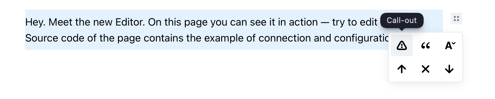
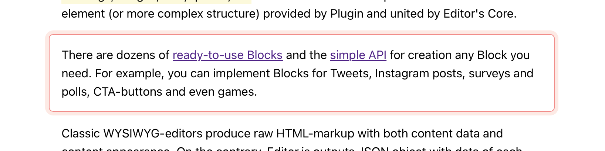
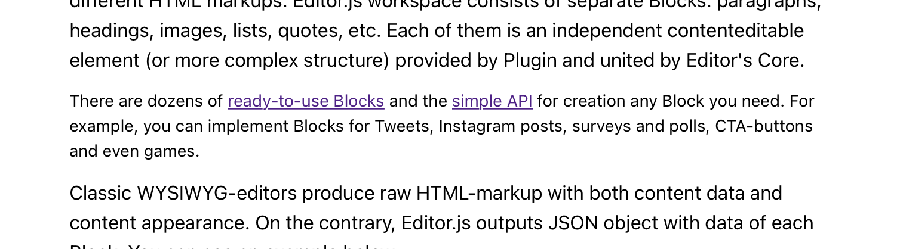

# Text Variant Tune

Editor.js Block Tune allows applying one of defined text variant: **Call-out**, **Citation**, and **Details** to any block.



## Variants

### Call-out

For important information the author wants to emphasize.



### Citation

To cite some full-text from a different source without using the Quote tool.


### Details

To add some information that is less important.



## How to use

1. Install

```js
yarn add text-variant-tune
```

2. Connect

```js
import EditorJS from '@editorjs/editorjs';
import TextVariantTune from 'text-variant-tune';

/**
 * Editor.js configuration
 */
const editor = new EditorJS({
  /**
   * Connect tool
   */
  tools: {
    textVariant: TextVariantTune
  },

  /**
   * Apply to all the blocks
   */
  tunes: ['textVariant'],

  // ...
})
```

Optionally, you can connect this Tune only for specified blocks:

```js
import EditorJS from '@editorjs/editorjs';
import TextVariantTune from 'text-variant-tune';

/**
 * Editor.js configuration
 */
const editor = new EditorJS({
  tools: {
    textVariant: TextVariantTune,
    paragraph: { // apply only for the 'paragraph' tool
      tunes: ['textVariant'],
    }
  },
})
```

## About

CodeX is a software engineering club unifying passionate engineers and designers around the world interested in making high-quality open-source projects and getting a priceless experience of making full-valued products on a global market.

[twitter.com/codex_team](https://twitter.com/codex_team)

[codex.so](https://codex.so)

